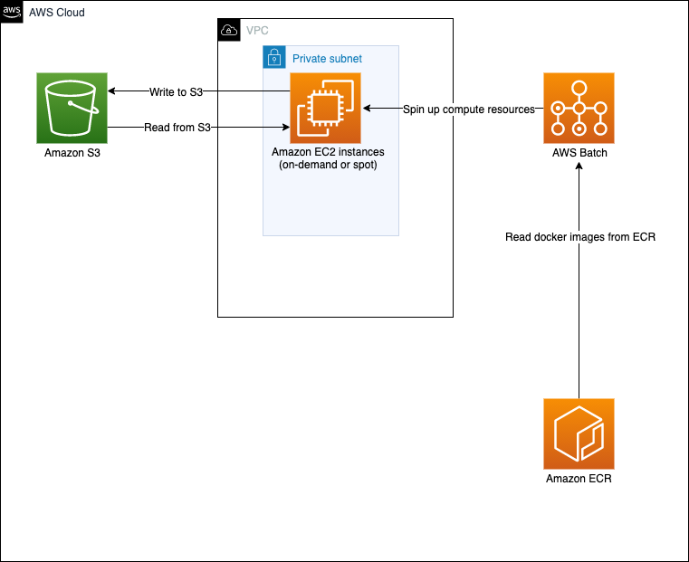
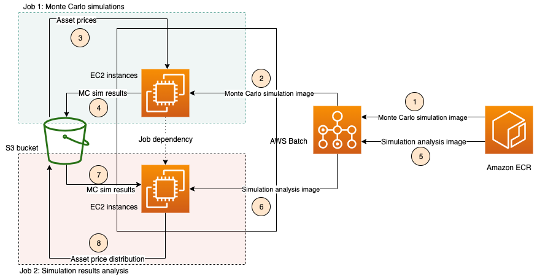

# Monte Carlo simulations for finance

Refer to AWS Workshop Studio for detailed code implementation steps - https://catalog.us-east-1.prod.workshops.aws/v2/workshops/f0e00661-b38d-43d3-b731-7fb608e71d32/en-US/intro

## Architecture diagram



## Code Layout
```
|-- coll
| |--Dockerfile
| |--mc_sum_coll_blog.py
| |--requirements.txt
|-- infra
| |--template.yml
|-- sim
| |--Dockerfile
| |--mc_sim_blog.py
| |--requirements.txt
|-- assest_prices.csv
|-- bnp.sh
|-- README.md
```

### Description
- `infra`: contains CloudFormation template
- `sim`: first step of MC simulation workbench, where an array of Batch jobs
  are run to perform MC simulations to get final asset prices
- `coll`: second step of MC simulation workbench, where the results of all
  MC simulations of first step are collected and analyzed; can be replaced
  by other kinds of analyses for MC simulation results.  
  [COMMENT: This is the reason to split this up into 2 distinct steps, as
  the analysis of MC results needed in each case is independent of running
  the MC simulations themselves]
- `assest_prices.csv`: dataset
- `bnp.sh`: build and push file to package code


## Solution overview


### Prerequistes
Install the [latest version of AWS CLI v2](https://docs.aws.amazon.com/cli/latest/userguide/cli-chap-install.html).

### How to get asset prices for input to the Monte Carlo simulations
1. Install [yfinance](https://pypi.org/project/yfinance/).
2. Now you can generate the CSV files for asset prices in Python as shown below:
```
import yfinance as yf
data = yf.download("SPY AMZN", start="2017-01-01", end="2017-04-30", group_by='ticker', auto_adjust=True)
asset = pd.DataFrame()
# Note that if you're only generating data for a single asset, e.g., 'AMZN', do this instead:
# asset["AMZN"] = data['Close']
asset["SPY"] = data["SPY"]['Close']
asset["AMZN"] = data["AMZN"]['Close']
asset.to_csv("asset_prices.csv")
```

## Steps to create infrastructure, package code in docker images and launch AWS Batch jobs

1. For running both steps in AWS Batch, first run the cloudformation template as:
   ```
   export STACK_NAME="pba-monte-carlo-aws-batch-blog"
   aws cloudformation create-stack --stack-name ${STACK_NAME} \
     --template-body file://infra/template.yml --capabilities CAPABILITY_IAM
   aws cloudformation wait stack-create-complete --stack-name ${STACK_NAME}
   ```
   Store the S3 bucket name created by this step as follows:
   ```
   export S3_BUCKET=$(aws cloudformation describe-stacks --stack-name ${STACK_NAME} \
     --query "Stacks[].Outputs[]" --output text | awk '$1="BucketName"{print $2}')
   ```
   Please note that you need to run this step only once, if you want to run the MC
   simulations again, no need to do this step again.
2. Package code into docker images and push to ECR
   ```
   chmod +x bnp.sh
   ./bnp.sh
   ```
   Note that you may see some errors in the output of this step if you don't have
   the latest version of AWS CLI v2 installed.
3. Before you submit the Batch jobs, you need to provide the input data based on
   which the Monte Carlo simulations will be run in the form of an input file named
   `asset_prices.csv`.
   This CSV file should have the same format as the one in this repository,
   viz., the first column is the time column (in this example, it contains the
   date), and the remaining columns contain the asset prices at that time (date).
   See the [section above](#how-to-get-asset-prices-for-input-to-the-monte-carlo-simulations)
   on how to create such an input file.
   This has to be put in a folder named `input/` in the bucket created by the
   CloudFormation template from step 1.
   Upload the CSV file containing asset prices to the S3 bucket from step 1 as:
   ```
   export SIM_JOB_NAME="pba-monte-carlo-sim-aws-batch-blog-job"
   aws s3 cp asset_prices.csv \
     s3://${S3_BUCKET}/${SIM_JOB_NAME}/input/asset_prices.csv
   ```
   Now you're ready to submit the Batch job for first step with the required
   number of Batch jobs by setting the size parameter of `array-properties`,
   e.g., 5, as shown in the example below:
   ```
   export JOB_QUEUE="pba-monte-carlo-aws-batch-job-blog-queue"
   aws batch submit-job --job-name ${SIM_JOB_NAME} --job-queue ${JOB_QUEUE} \
     --job-definition "pba-monte-carlo-sim-aws-batch-job-definition-blog" \
     --array-properties size=5 \
     --container-overrides "environment=[{name="N_PERIODS",value="321"},{name="N_SIMS",value="123"},{name="JOB_NAME",value="${SIM_JOB_NAME}"}]"
   ```
   Here `N_SIMS` denotes the number of Monte Carlo simulations to run in each
   Batch job, and `N_PERIODS` denotes the number of time periods for which to
   run the simulations.
   Submit the batch job for second step by first getting the JobID of the first
   step as:
   ```
   export JOBID=$(aws batch list-jobs --job-queue=${JOB_QUEUE} \
     --filters "name=JOB_NAME,values=${SIM_JOB_NAME}" \
     --query "jobSummaryList[0].jobId")
   aws batch submit-job --job-name "pba-monte-carlo-coll-aws-batch-blog-job" \
     --job-queue ${JOB_QUEUE} \
     --job-definition "pba-monte-carlo-coll-aws-batch-job-definition-blog" \
     --depends-on jobId=${JOBID} \
     --container-overrides "environment=[{name="JOB_NAME",value="${SIM_JOB_NAME}"}]"
   ```
   All outputs will be stored in the folder `output/` in the bucket stored under
   the environment variable `S3_BUCKET`.
   The output of the first step will be a series of CSV files that display the
   final asset prices for each Monte Carlo run (indexed by the index of the
   Batch job), whereas the output of the second
   step is a TXT file denoting the summary statistics of all the asset prices
   from all the Monte Carlo runs of the first step.

## Steps to clean-up
1. Store the names of the bucket created in step 1 by
   executing the following commands:
   ```
   export SIM_REPO=`aws cloudformation describe-stacks --stack-name ${STACK_NAME} \
     --query "Stacks[].Outputs[]" --output text | awk -F/ 'FNR==3 {print $2}'`
   export COLL_REPO=`aws cloudformation describe-stacks --stack-name ${STACK_NAME} \
     --query "Stacks[].Outputs[]" --output text | awk -F/ 'FNR==1 {print $2}'`
   export S3_BUCKET=`aws cloudformation describe-stacks --stack-name ${STACK_NAME} \
     --query "Stacks[].Outputs[]" --output text | awk 'FNR==2 {print $2}'`
   ```
1. To delete the two repositories from the output of step 1, run the following
   command for each of the two repositories:
   ```
   aws ecr delete-repository --repository-name ${SIM_REPO} --force
   aws ecr delete-repository --repository-name ${COLL_REPO} --force
   ```
1. To delete the S3 bucket from the output of step 1, run:
   ```
   aws s3 rm s3://${S3_BUCKET} --recursive
   ```
1. Now you can delete all the resources created by the cloudformation template
   in step 1 as:
   ```
   aws cloudformation delete-stack --stack-name ${STACK_NAME}
   ```

### Procedure to run python scripts locally:
1. Ensure all python libraries in the corresponding `requirements.txt`
   are installed in your virtual environment.
1. For running `sim/mc_sim_blog.py`, you need to set environment variables
   `AWS_BUCKET` and `AWS_BATCH_JOB_ARRAY_INDEX`, e.g., as:
   ```
   export AWS_BATCH_JOB_ARRAY_INDEX="3"
   export AWS_BUCKET="<your-bucket-name>"
   export N_PERIODS="123"
   export N_SIMS="123"
   export JOB_NAME="pba-monte-carlo-sim-blog"
   aws s3 cp asset_prices.csv s3://${AWS_BUCKET}/${JOB_NAME}/input/asset_prices.csv
   python sim/mc_sim_blog.py
   ```
   Note that this script will put files in a bucket, so gave name of a
   bucket you have full access to above.
1. For testing the Docker image created by `sim/Dockerfile` locally, you
   need to build the image first and run it by setting environment variables
   as well as giving it access to your AWS credentials as:
   ```
   cd sim/
   docker build -t mc_sim_blog .
   docker run -e AWS_BUCKET="<your-bucket-name>" \
    -e  AWS_BATCH_JOB_ARRAY_INDEX="4" -e N_PERIODS="111" -e N_SIMS="101" \
    -e JOB_NAME="pba-monte-carlo-sim-blog" -v ~/.aws:/root/.aws:ro mc_sim_blog
   ```
1. For running `coll/mc_sim_blog.py`, you need to set environment variable
   `AWS_BUCKET`, e.g.., as:
   ```
   export AWS_BUCKET="<your-bucket-name>"
   export JOB_NAME="pba-monte-carlo-sim-blog"
   python coll/mc_sim_coll_blog.py
   ```
   Note that this script will put files in a bucket, so give the name of a
   bucket you have full access to as above.
1. For testing the Docker image created by `coll/Dockerfile` locally, you
   need to build the image first and run it by setting environment variables
   as well as giving it access to your AWS credentials as:
   ```
   cd coll/
   docker build -t mc_sim_coll_blog .
   docker run  -e AWS_BUCKET="<your-bucket-name>" \
   -e JOB_NAME="pba-monte-carlo-sim-blog" \
   -v ~/.aws:/root/.aws:ro mc_sim_coll_blog
   ```

# Security

See [CONTRIBUTING](CONTRIBUTING.md#security-issue-notifications) for more information.

# License

This library is licensed under the MIT-0 License. See the LICENSE file.


